# Open-Source Infographic Cards

Purpose-built, shareable knowledge cards for the parental-alienation field. Each card is designed for a specific educational job — vocabulary, statistic, framework, or tactic — and is intended to be embedded, reposted, and used in advocacy/educational contexts.

All cards: 1200×630 PNG, CC BY 4.0, attribution to [AntiAlienate.com](https://www.antialienate.com).

## Frameworks

### Bernet's 5-Factor Model of Parental Alienation

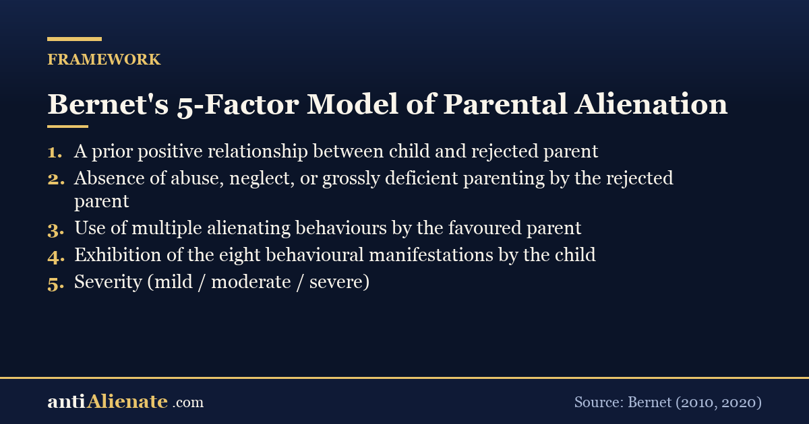

The diagnostic spine: five factors that distinguish PA from estrangement.

### Eight Behavioural Manifestations of PA (Bernet)

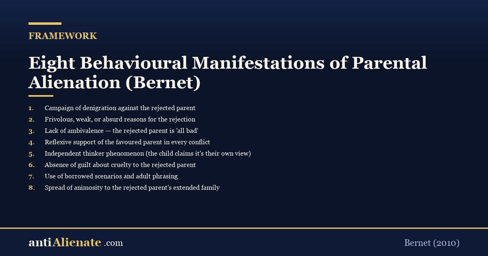

The eight observable child-behaviour markers Bernet uses to identify alienation.

### Strand Lobben v Norway — [ECHR Article 8](https://www.legislation.gov.uk/ukpga/1998/42/schedule/1) doctrine

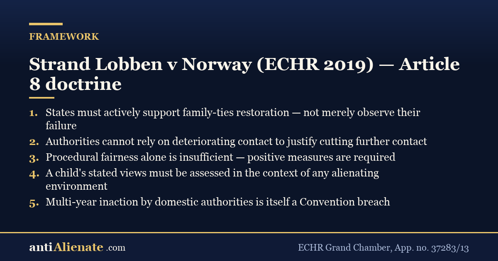

The Grand Chamber case requiring states to actively support family-ties restoration.

### Brazil — Lei 12.318/2010 (Lei da Alienação Parental)

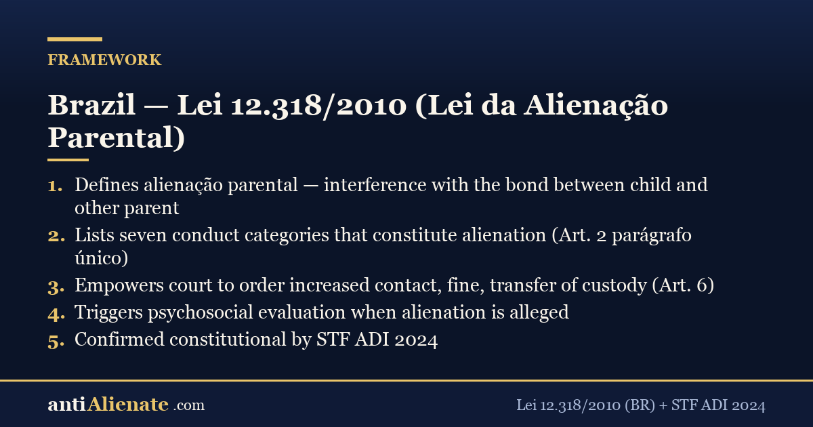

Brazilian statute defining alienação parental + 7 conduct categories + remedies. Constitutionality reaffirmed [STF](https://portal.stf.jus.br/) ADI 2024.

### [Family Bridges](https://warshak.com/family-bridges/) / [Warshak](https://warshak.com/family-bridges/) — Welcoming Our Children Home

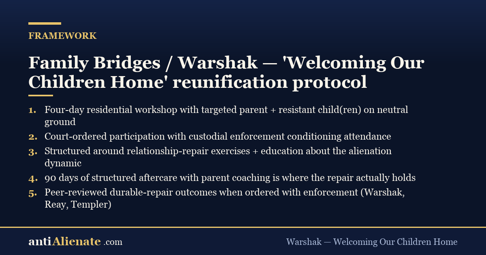

Four-day residential reunification intensive + 90-day aftercare. The leading evidence-based protocol.

## Statistics

### [ICD-11](https://icd.who.int/) QE52.2 — Caregiver-child relationship problem

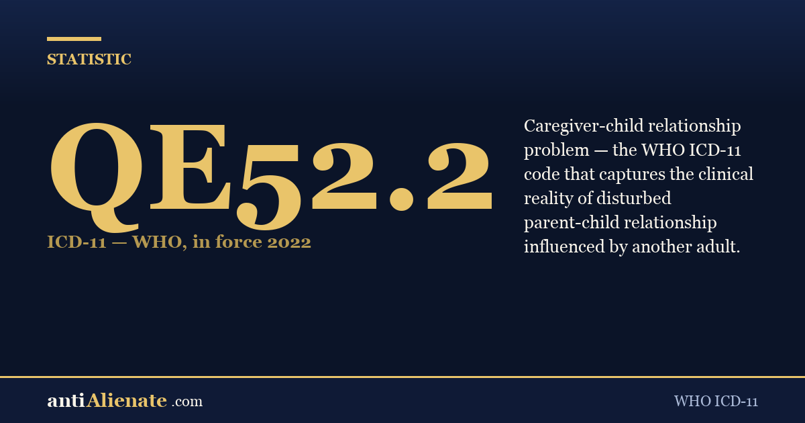

WHO clinical code naming the dynamic. In force since 2022.

### [DSM-5-TR](https://www.appi.org/products/dsm) V61.29 — Child affected by parental relationship distress

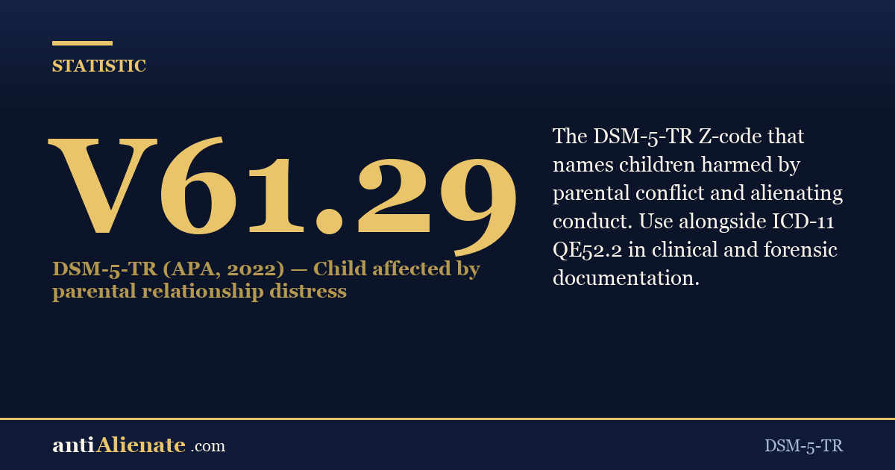

Companion to [ICD-11](https://icd.who.int/) QE52.2. The [DSM-5](https://www.appi.org/products/dsm)-TR Z-code for children harmed by parental conflict.

### 85% of children with behavioural disorders come from fatherless homes

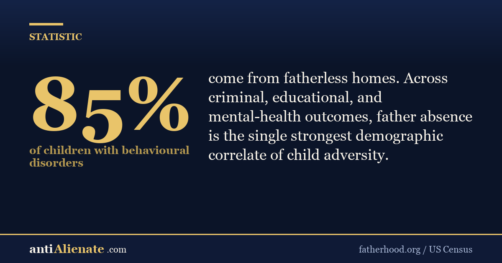

US Census / fatherhood.org statistic on father-absence as a child-adversity correlate.

## Vocabulary

### Astreintes (Belgium / France / Netherlands)

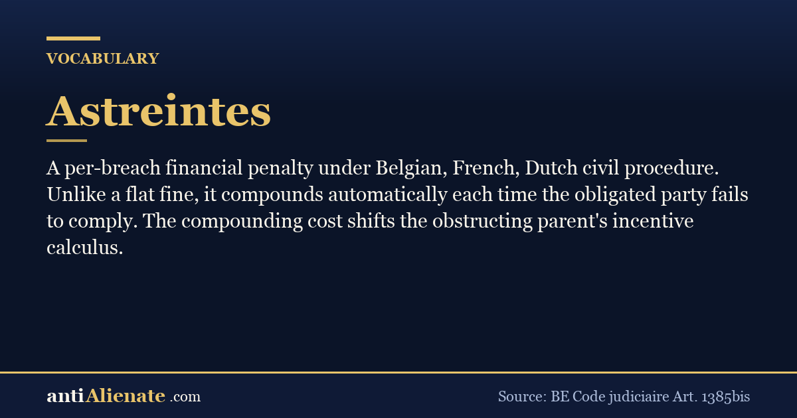

Per-breach financial penalty that compounds. Stronger than flat fines.

### Affido super-esclusivo (Italy)

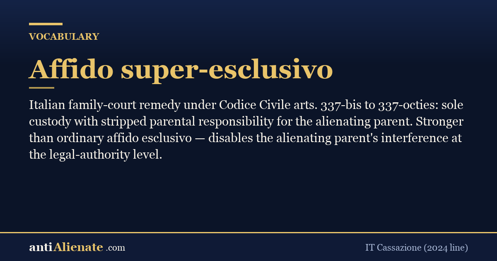

Italian sole-custody-with-stripped-parental-authority remedy.

### Gezagsbeëindiging (Netherlands)

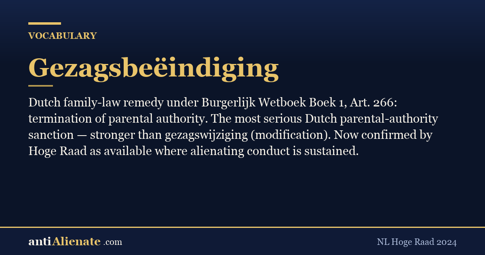

Dutch termination-of-parental-authority remedy under BW Boek 1 Art. 266.

### Troxel v. Granville (SCOTUS 2000)

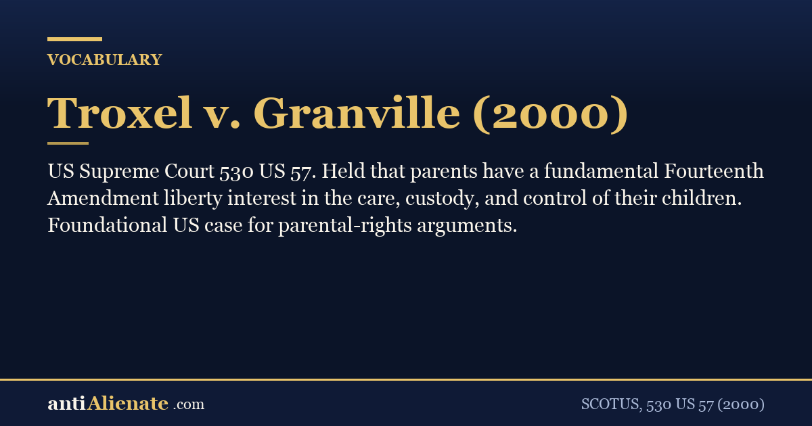

Foundational [US Supreme Court](https://www.supremecourt.gov/) case affirming parents' fundamental 14th-Am liberty interest.

### UK GDPR Article 15 — Subject Access Right

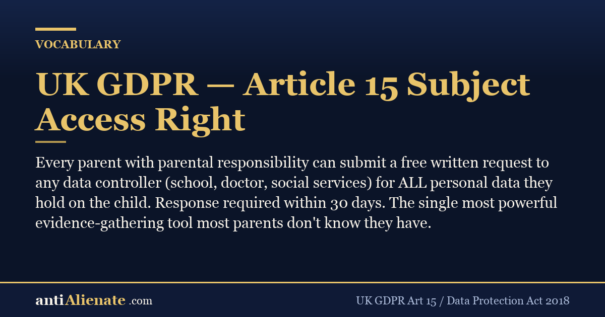

Every parent with parental responsibility can pull EVERYTHING the school/doctor/social-services holds on the child.

## Tactics

### Three things to prepare before [Cafcass](https://www.cafcass.gov.uk/) / GAL / court-psychologist interview

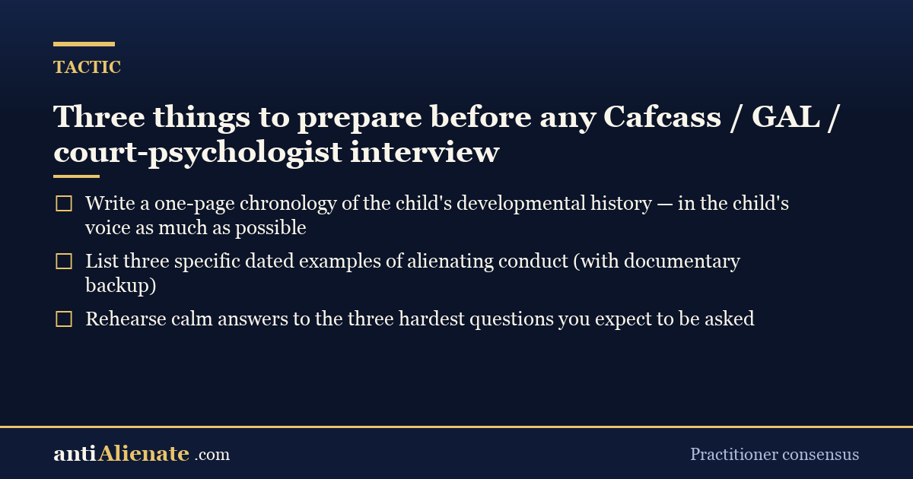

Practitioner-consensus prep checklist for the highest-stakes interview in your case.

### The contact-log spreadsheet that wins cases

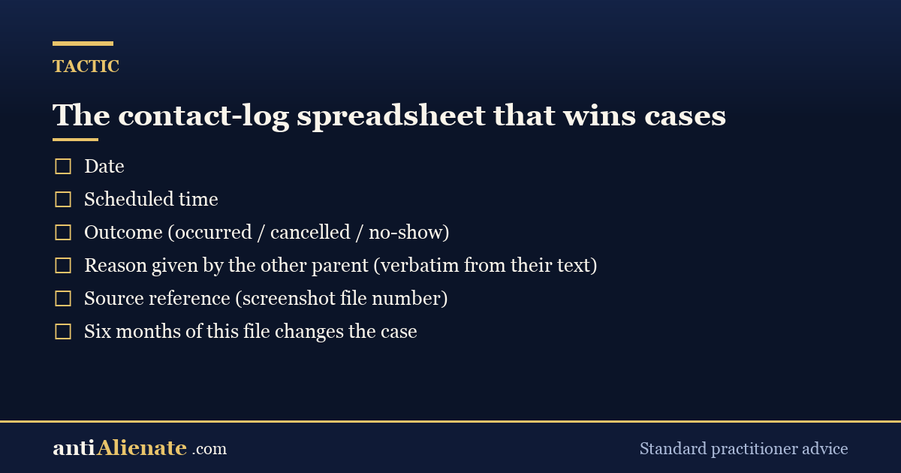

Column structure for the dated contact log that beats any oral testimony.

### Use GDPR Art. 15 to pull the school's full file on your child

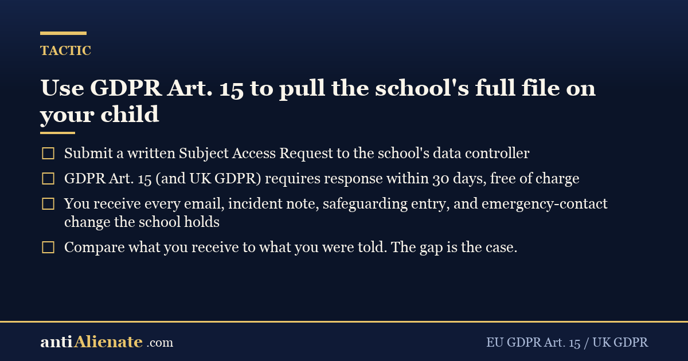

How to get everything the school holds on your child — free, in 30 days.

### How to ask a Belgian / French judge for an astreinte

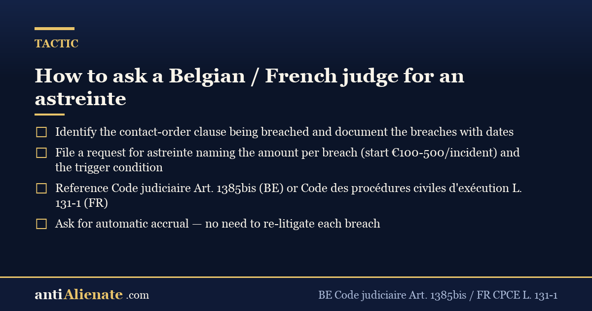

Four-step procedural ask for automatic per-breach accrual.

---

## Using these cards

- Embed directly in your blog, advocacy site, or social post.
- Adapt and remix under CC BY 4.0 — credit AntiAlienate.com.
- New card requests via GitHub issue. PRs welcome (generator: `make-card-v1.py`).

— Curated by Alan Markson · [AntiAlienate.com](https://www.antialienate.com) · CC BY 4.0

<!-- AA-CITE-START -->

---

## Sources & authoritative references

**Referenced in this page:**

- [DSM-5-TR (APA)](https://www.appi.org/products/dsm)
- [ICD-11 (WHO)](https://icd.who.int/)

**Topic baseline (independently verifiable):**

- [AntiAlienate Knowledge Base](https://knowledge.antialienate.com/)
- [DSM-5-TR (APA)](https://www.appi.org/products/dsm)
- [ICD-11 (WHO)](https://icd.who.int/)
- [HCCH — Hague Conference](https://www.hcch.net/)
- [Council of Europe](https://www.coe.int/)

<!-- AA-CITE-END -->

<!-- AA-CROSSLINK-START -->

---

## Related on antialienate.com

- [Echr Article 8 Parental Alienation Weapon](https://www.antialienate.com/blog/echr-article-8-parental-alienation-weapon)
- [Parental Alienation Is Child Abuse Clinical Legal Consensus](https://www.antialienate.com/blog/parental-alienation-is-child-abuse-clinical-legal-consensus)
- [Stockholm Syndrome And Parental Alienation The Captive Child](https://www.antialienate.com/blog/stockholm-syndrome-and-parental-alienation-the-captive-child)
- [Adult Children Of Parental Alienation](https://www.antialienate.com/blog/adult-children-of-parental-alienation)
- [Belgium Parental Alienation Equal Custody Enforcement](https://www.antialienate.com/blog/belgium-parental-alienation-equal-custody-enforcement)

<!-- AA-CROSSLINK-END -->
